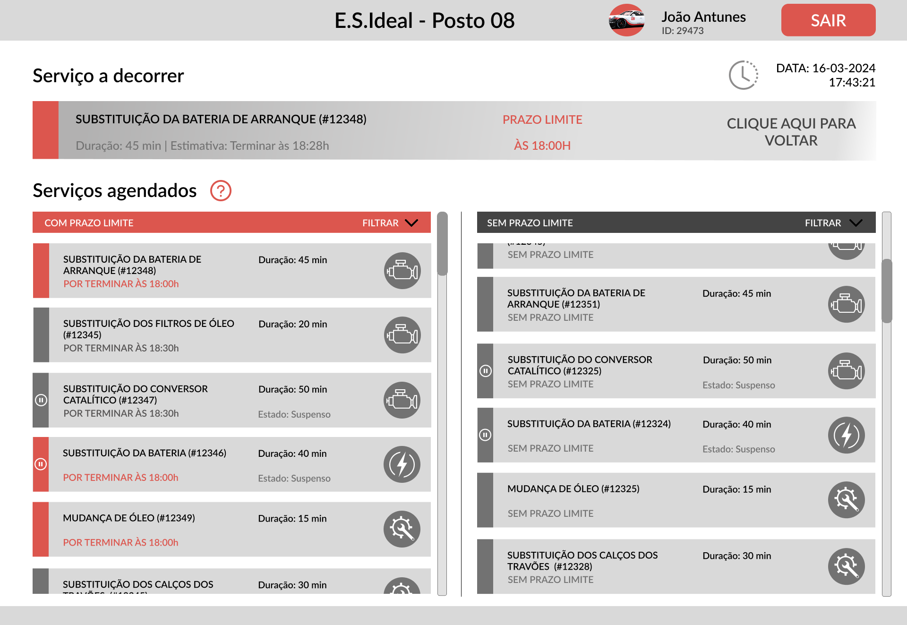

# 🔧 E.S.Ideal — Workshop Management Interface

## 📖 Overview

*Demo page*


E.S.Ideal is a web application designed to help mechanics manage and carry out vehicle services in a workshop environment. The project was developed with a focus on **UI/UX, usability, and interactive interface design**, rather than backend development.

The interface was designed to support mechanics with different levels of experience, providing clear workflows for managing assigned services, inspecting vehicle and customer information, and starting, suspending, and completing repairs.

Key design considerations included:

- Clear visual hierarchy and service status indicators.
- Large, accessible interface elements suitable for a workshop environment (precise interactions are difficult for older users, or users with gloves).
- Filtering, sorting, and service prioritization.
- Clear feedback and confirmation mechanisms to prevent errors.
- Reusable components and consistent interaction patterns.

The application uses a **JSON Server mock backend** to provide the data required by the frontend.

---

## 📚 Documentation

- Presentation: [Presentation](repo_description/presentation.pdf)
- Figma Mockup: [Figma Design](https://www.figma.com/design/GmqrjPl8rs7rdYdfkNIih1/IPM-grupo-34?m=auto&t=5zKcNIynYzN69SgB-1)

---

## 🛠️ Technologies

- **Frontend:** JavaScript, Vue.js
- **UI/UX:** Figma
- **Backend:** JSON Server
- **Development:** Git, npm

---

## 🚀 Setup

The project requires **Node.js** and **npm**.

Start the mock backend:

```bash
cd backend
json-server --watch db.json
```

In a separate terminal, start the frontend:

```bash
cd ESIdeal
npm i
npm run dev
```

### Demo Login
```
Username: user
Password: 123
```
---

## 👥 Authors

* Guilherme Rio ([GitHub](https://github.com/GuiRio99))
* Ivan Ribeiro ([GitHub](https://github.com/IVSOP))
* Nuno Aguiar ([GitHub](https://github.com/Naga1101))
* Pedro Ferreira ([GitHub](https://github.com/pedromeruge))
* Rui Cerqueira ([GitHub](https://github.com/Rui50))

"Human-Computer Interaction" Final Project — University of Minho, 2024